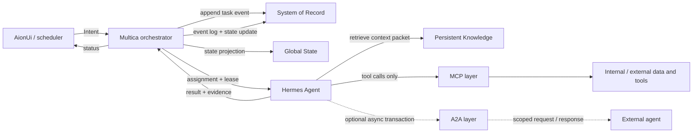

# Робастная multi-agent среда

Робастная multi-agent среда разделяет управление задачей, исполнение, память, tool access и межагентную коммуникацию. Цель паттерна - сделать работу нескольких агентов воспроизводимой: каждое действие имеет owner, trace, состояние и границу доверия.

## Проблема

Multi-agent система быстро становится хрупкой, если:

- пользовательский intent сразу попадает в произвольный prompt агента;
- общий state хранится только в контексте модели;
- агенты напрямую ходят в базы, API и чужие runtime без единого контракта;
- внешние агенты получают лишний внутренний контекст;
- статус задачи живёт в UI, но не в System of Record;
- результат нельзя replay-нуть по журналу событий.

В такой архитектуре сбой одного шага превращается в потерю статуса, дублирование работы или конфликт между агентами.

## Решение

Использовать layered operating loop:

1. Операторский UI или планировщик создаёт Intent.
2. Оркестратор регистрирует задачу в System of Record, обновляет global State и назначает исполнителя.
3. Исполнительный агент извлекает scoped context из своей persistent knowledge базы.
4. Любые внутренние и внешние данные доступны агенту только через стандартизированный MCP слой.
5. Если нужна сторонняя экспертиза, агент открывает A2A транзакцию с внешним агентом и ждёт асинхронный ответ.
6. Результат возвращается оркестратору, который фиксирует event log, обновляет State projection и отдаёт статус в UI.

В терминах текущей карты источников это можно читать как связку: [AionUi](../../sources/libraries-tools/aionui.md) или внутренний scheduler создаёт operator-facing intent, [Multica](../../sources/libraries-tools/multica.md) выполняет project/task orchestration, Hermes Agent исполняет задачу, MCP изолирует tool access, а [Agent2Agent (A2A) Protocol](../../sources/libraries-tools/a2a-protocol.md) используется только для agent-to-agent collaboration.

## Архитектура



### System of Record vs State

System of Record - append-only источник истины: intent, assignment, lease, tool observations, A2A requests, approvals, result, errors. Его задача - audit и replay.

Global State - материализованная проекция для маршрутизации и UI: текущий status, owner, blockers, progress, deadlines, latest artifact. Его можно пересобрать из System of Record.

Не смешивайте эти слои. Если UI показывает статус, которого нет в журнале, система уже потеряла проверяемость.

### Intent contract

Intent должен быть структурированным, а не свободным сообщением:

```yaml
intent_id: uuid
correlation_id: uuid
actor: operator | scheduler | agent
goal: short task goal
scope:
  repositories: []
  data_domains: []
  allowed_tools: []
success_criteria: []
constraints: []
priority: normal
deadline: null
approval_policy: default
idempotency_key: stable-key
```

Минимальное правило: агенту нельзя назначать задачу, пока неизвестны цель, scope, критерии успеха и policy для side effects.

## Исполнительный цикл

```text
receive intent
record TaskCreated in System of Record
project task into Global State
assign Hermes Agent with lease and correlation_id

Hermes Agent:
  retrieve scoped historical context from Persistent Knowledge
  plan next steps against success_criteria
  call data/tools only through MCP
  if external expertise is needed:
    create A2A transaction with scoped context
    persist waiting state and timeout
    resume when response arrives
  produce result, evidence, and state delta

Multica:
  validate result envelope
  append completion/failure events
  update State projection
  notify AionUi/operator
```

## Надёжность

### Assignment и lease

Назначение задачи должно быть lease-based:

- агент claim-ит задачу на ограниченное время;
- heartbeat продлевает lease;
- если heartbeat исчез, оркестратор переводит задачу в stale или reassignable;
- повторный запуск использует idempotency key, чтобы не создать дублирующие side effects.

### MCP как единственный integration boundary

Hermes Agent не ходит напрямую в базу, shell, SaaS API или внутренний сервис. Он вызывает capability через MCP tool contract, где явно описаны:

- schema входа и выхода;
- permissions;
- side effects;
- retry policy;
- audit fields;
- approval requirements;
- формат observation.

Это делает интеграции заменяемыми и снижает риск prompt injection из внешних данных.

### A2A как транзакция, не как shared memory

Внешний агент не получает внутреннюю persistent memory Hermes Agent. Через A2A передаётся только scoped request:

- цель запроса;
- минимальный контекст;
- формат ожидаемого ответа;
- deadline/timeout;
- correlation_id;
- policy на использование результата.

Ответ внешнего агента считается evidence, а не истиной. Hermes Agent должен проверить его через собственные criteria или MCP-backed источники перед фиксацией результата.

### Failure modes

| Сбой | Реакция |
|---|---|
| MCP tool timeout | записать observation, retry только для идемпотентного вызова |
| Permission denied | остановить retry, вернуть blocked state |
| A2A timeout | зафиксировать partial result или escalated blocker |
| Agent heartbeat lost | закрыть lease, пометить task stale, разрешить reassign |
| Conflict in State | resolver читает System of Record и пересобирает projection |
| Неполный результат | вернуть агенту structured revision request |

## Когда применять

Паттерн нужен, если:

- есть несколько agent runtimes или внешних агентов;
- задачи длинные, асинхронные или дорогие;
- важны audit, replay и operator-facing status;
- инструменты имеют разные trust boundaries;
- agent-to-agent collaboration должна быть ограниченной и проверяемой;
- результаты должны переживать падение UI, агента или runtime.

Для короткого single-agent workflow достаточно обычного [Agent Harness](agent-harness.md) с MCP tools и локальным журналом.

## Антипаттерны

- UI status как единственный источник правды.
- Общая память для всех агентов без owner и provenance.
- Direct tool/API access в обход MCP.
- A2A как "перекинем весь контекст другому агенту".
- Автоматический retry действий с external side effects.
- Несколько агентов пишут в один artifact без lock, owner или resolver.
- Нет correlation_id между UI, оркестратором, tools и A2A транзакциями.

## Связанные заметки

- [Multi-agent orchestration](../implementation/multi-agent-orchestration.md) - роли, shared state и conflict resolution.
- [Tool use, function calling и MCP](../fundamentals/tool-use-and-mcp.md) - tool contract, permissions и retry.
- [Agent Harness](agent-harness.md) - рабочая обвязка вокруг агента.
- [Персистентная память агента](../advanced/agent-memory-patterns.md) - memory tiers и checkpointing.
- [Безопасность агентных систем](agent-security.md) - trust boundaries, sandbox и audit.
- [Human-in-the-loop UX](../production-operations/human-in-the-loop-ux.md) - operator approvals и статус задач.
- [Production operations](../production-operations/production-operations.md) - эксплуатация, tracing и recovery.
